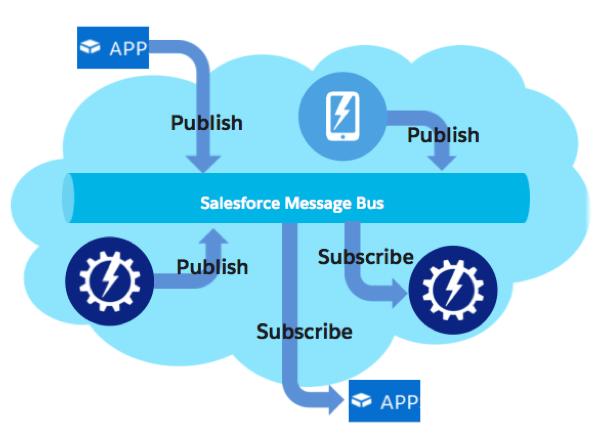
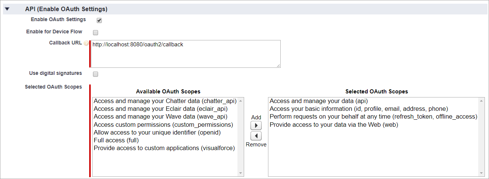
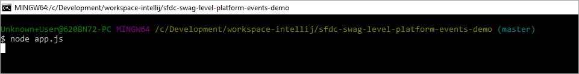
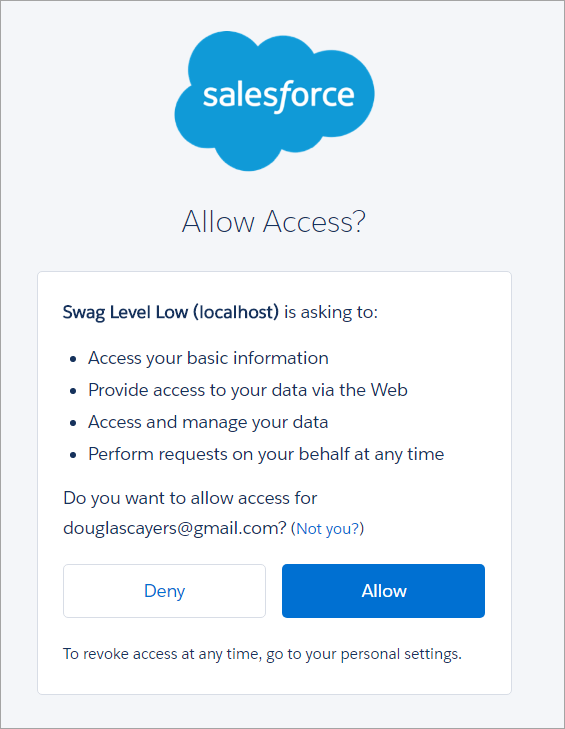
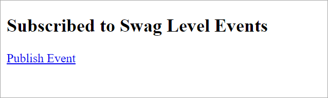
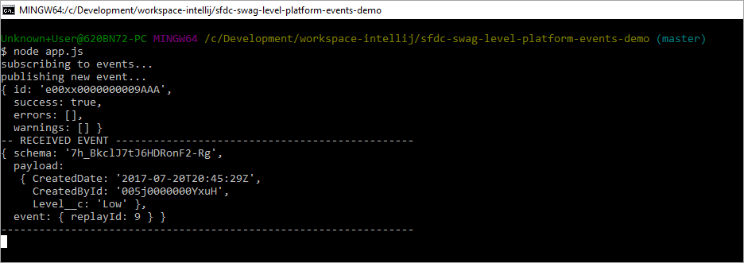

Swag Level Platform Events Demo
===============================

Overview
--------

Example subscribing and publishing Platform Events in nodejs using jsforce, humorously to know when swag levels get dangerously low 😉

Demo app created for the [Nashville Salesforce TrailheaDX meetup](https://www.meetup.com/Nashville-Salesforce-Developer-User-Group/events/239966938/).



Getting Started
---------------

1. Ensure [Node.js 8.2.0](https://nodejs.org/en/download/current/) or greater is installed on your machine

2. Create a connected app and enable **OAuth Settings**



3. In Salesforce Setup, navigate to **Platform Events**

4. Create a new event object named "Swag Level" (`Swag_Level__e`) with one custom text field named "Level" (`Level__c`)

5. Checkout this GitHub project locally

6. In the root folder of the project, create a text file named `.env` with the following properties:

```
NODE_ENV=development

# ==========================================
# Salesforce OAuth
# ==========================================

OAUTH_SALESFORCE_LOGIN_URL=https://login.salesforce.com
OAUTH_SALESFORCE_CLIENT_ID=your_connected_app_client_id
OAUTH_SALESFORCE_CLIENT_SECRET=your_connected_app_client_secret
OAUTH_SALESFORCE_REDIRECT_URI=http://localhost:8080/oauth2/callback

# ==========================================
# Salesforce
# ==========================================

SALESFORCE_API_VERSION=40.0

```
 
7. From command line, navigate to the root folder of the project and run the command `node app.js`



8. In your browser, navigate to `http://localhost:8080` (you'll be prompted to login with your Salesforce credentials via oauth)



9. When the page loads, click the **Publish Event** link to cause a new `Swag_Level__e` record to be published.



10. In your command console you should see nearly immediately a message that the event has been received.




Next Steps
----------

Using the Node.js and Salesforce API is not the only way to subscribe or publish to Platform Events.
You can also subscribe to events via an **Apex Trigger** configured for the `after insert` trigger event on your `__e` object, 
as you would for any other sobject.

You can also publish new events similarly to how you would create any other sobject, just insert a new `__e` record.
You can even publish events via Process Builder or Flows since they can insert records too.

Note, although the look and feel of Platform Event objects is like SObjects (that's intentional for easier adoption), they are **not**
data like your SObject records like accounts and contacts. If your regular Salesforce transaction rolls back, any events you've published
are not rolled back.


Resources
---------

* [Platform Events Developer Guide](https://developer.salesforce.com/docs/atlas.en-us.platform_events.meta/platform_events/platform_events_intro.htm)
* [Platform Events Basics on Trailhead](https://trailhead.salesforce.com/modules/platform_events_basics)
* [First Impressions with Platform Events](https://developer.salesforce.com/blogs/developer-relations/2017/05/first-impressions-platform-events-salesforce-enterprise-messaging-platform.html)
* [Event Driven Architectures with Platform Events](https://www.youtube.com/watch?v=ihwoG2Pql7Q)
* [#10 thoughts about Platform Events](https://albasfdc.wordpress.com/2017/06/11/10-thoughts-about-platform-events/)